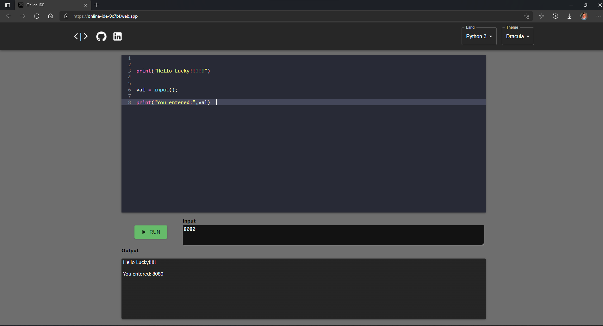
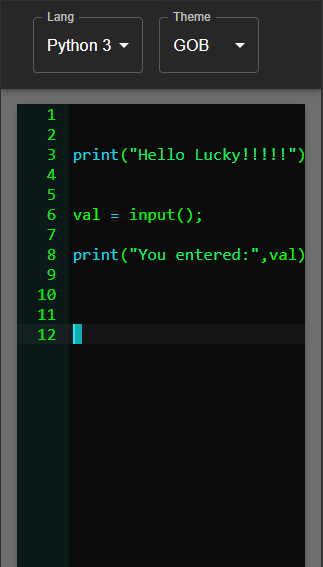
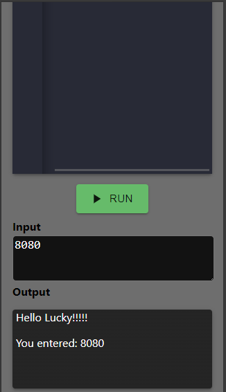

# Online_IDE

https://online-ide-9c7bf.web.app/

Snapshots of the project 👇





## Environment variable
 ###  Frontend 
 1. Create .env
 2. ```
    REACT_APP_BACKEND_URL=YOUR_BACKEND_URL
    ```

 ### Backend 
 1. Create a account on [jdoodle](https://www.jdoodle.com/compiler-api/).
 2. Create nodemon.json
 3. 
    ```json
    {
        "env": {
            "CLIENT_ID": "YOUR_JDOODLE_CLIENT_ID",
            "CLIENT_SECRET": "YOUR_JDOODLE_CLIENT_SECRET",
            "URL": "https://api.jdoodle.com/v1/execute"
        }
    }
    ```

